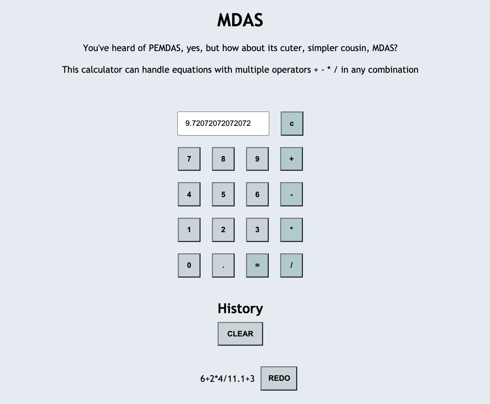

# MDAS

## Description

You've heard of PEMDAS, yes, but how about its cuter, minimalist cousin, MDAS? This calculator can handle equations with multiple operators + - * / in any combination!

This calculator sends data to a server, where the math is performed and a history of equations are kept. The answer is displayed on the calculator input, and a history of past equations is shown below. You can also re-run past calculations and clear the history from the server: C, R, and D of CRUD!

[Deployed, fully functional version of the app here!](https://mdas-server-side-calculator.herokuapp.com/)

## Screenshot

## Usage

* Use the input number and operator buttons to build your equation
  * Only valid equations will be computed - for example, no starting with an operator. Prompts will show you any errors of your ways :)
  * The order of operations (multiplication and division, then addition and subtraction, both from left to right), are respected.
* When you press submit (the "=" button), the equation is sent to the server, and is stored and computed.
* The server then sends back the answer, and updates the DOM with the history of all equations computed. 
* You can use the "redo" buttons beside each past equation to submit them again
* The "Clear" button clears the history from the server

## Built With

Javascript, jQuery, Express, Node.js, AJAX, HTML, CSS, Heroku

## Acknowledgement 

Thanks to [Prime](https://github.com/PrimeAcademy/ "Prime") and our instructor [Dev](https://github.com/devjanaprime/ "Dev") for setting up the parameters of the assignment and providing inspiring stretch goals! Thank you also to my Ionian cohort buddies for keeping the slack channel alive with posts while we work on our first server challenge!
